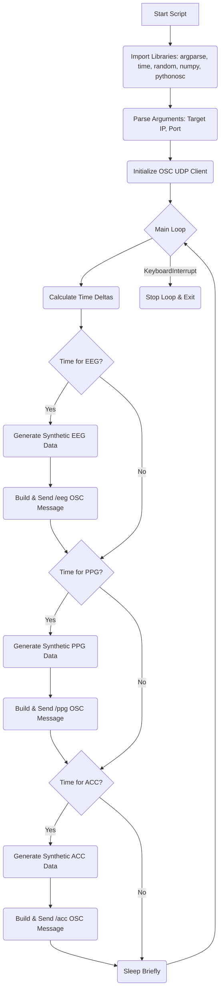

# Plan for `send_synthetic_osc.py` - Synthetic OSC Data Generator

**1. Goal:**

*   Create a standalone Python script (`send_synthetic_osc.py`) that generates synthetic data mimicking the Muse S output and sends it as OSC messages to a specified IP address and port (where `stress_monitor.py` would be listening).

**2. Data Streams to Simulate:**

*   **/eeg:** 4 channels of floating-point data, simulating EEG signals. Target rate: ~256 Hz.
*   **/ppg:** 3 floating-point values (sensor\_id, value, sensor\_id), simulating PPG signal. Target rate: ~64 Hz.
*   **/acc:** 3 floating-point values (x, y, z), simulating accelerometer data. Target rate: ~50 Hz.

**3. Core Functionality:**

*   **OSC Client:** Use the `python-osc` library (specifically `udp_client`) to send messages.
*   **Data Generation:** Implement functions to generate somewhat realistic synthetic data for each stream:
    *   **EEG:** Generate random noise within a plausible voltage range, potentially adding some low-frequency sinusoidal components to mimic brainwaves.
    *   **PPG:** Generate a periodic signal (like a sine wave) with added noise to simulate heartbeats. Allow for slight variations in frequency (simulating heart rate changes).
    *   **ACC:** Generate random noise around a baseline (e.g., simulating gravity on one axis) with occasional larger shifts to mimic movement.
*   **Timing:** Implement a main loop that attempts to send messages at the target frequencies for each stream. Use `time.sleep()` carefully to manage the send rate without consuming excessive CPU.
*   **Configuration:** Use `argparse` to allow specifying the target IP address and port via command-line arguments (defaulting to `127.0.0.1` and `5001`). Optionally, add arguments to control data characteristics (e.g., average simulated heart rate, noise levels).

**4. Script Structure:**

**5. Implementation Steps:**

1.  Create the basic script structure with imports, argument parsing, and OSC client setup.
2.  Implement the data generation functions (`generate_eeg`, `generate_ppg`, `generate_acc`).
3.  Implement the main loop with timing logic for sending messages for each stream.
4.  Add error handling (e.g., for OSC sending issues) and graceful exit on `KeyboardInterrupt`.
5.  Test the script by running it and observing the OSC messages received by a simple listener (or by `stress_monitor.py` itself).