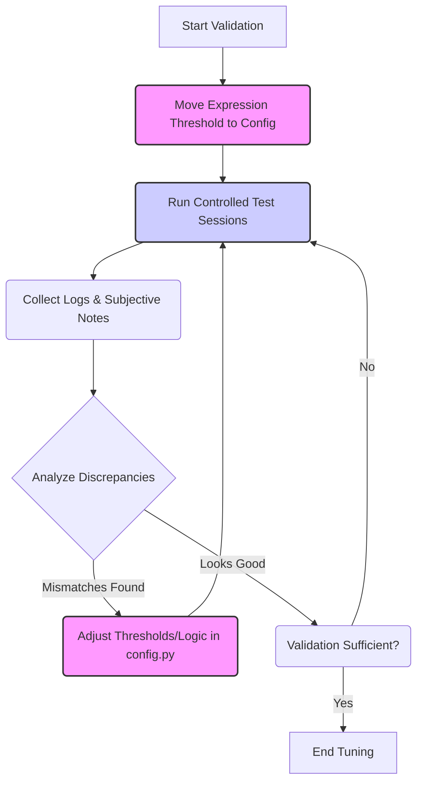

# BrainTrade Monitor - Validation & Tuning Plan

**Objective:** To validate the accuracy of the current state classification logic (Phase 2 + partial Phase 3) and tune the relevant thresholds and parameters for better alignment with the user's actual mental state.

**Current State Logic Summary (Based on `state_logic.py` and `config.py`):**

*   **Inputs:** Alpha/Beta Ratio, Heart Rate (HR), Movement Metric, Theta Power, Facial Expression Dictionary.
*   **Thresholds:** Compares inputs against baseline median +/- `THRESHOLD * std_dev`. All physiological thresholds (`RATIO_THRESHOLD`, `HR_THRESHOLD`, `MOVEMENT_THRESHOLD`, `THETA_THRESHOLD`) are currently set to `1.5` in `config.py`.
*   **Expression:** Uses a weighted score based on expression probabilities. `EXPRESSION_STRESS_THRESHOLD` is hardcoded at `0.3` in `state_logic.py`.
*   **Rules (Prioritized):** Drowsy/Distracted -> Stress/Tilted -> Warning -> Calm/Focused -> Other/Uncertain.
*   **Persistence:** State must persist for `STATE_PERSISTENCE_UPDATES = 6` updates (3 seconds) to become official.

**Proposed Validation & Tuning Process:**

**Steps:**

1.  **Initial Code Change (Recommended):**
    *   Move the hardcoded `EXPRESSION_STRESS_THRESHOLD = 0.3` from `state_logic.py` to `config.py` to make it easily configurable.
2.  **Validation Sessions:**
    *   Run `main.py` for several short sessions (e.g., 2-3 minutes each after baseline) under deliberately induced conditions:
        *   **Relaxed:** Sitting quietly, deep breathing.
        *   **Focused:** Concentrating on a specific mental task.
        *   **Stressed:** Thinking about a stressful event or performing a challenging task.
        *   **Movement:** Intentionally moving the head moderately while trying to stay otherwise calm.
        *   **Drowsy (Optional):** If feeling naturally drowsy.
3.  **Data Collection:**
    *   During each session, record:
        *   The full log output from `main.py` (ensure DEBUG level is enabled).
        *   Subjective notes on your actual mental/physical state throughout the session, timestamped if possible.
4.  **Analysis:**
    *   Compare the application's reported state (`State updated: ...` messages in the log) against your subjective notes for each session.
    *   Examine the feature values and intermediate flags (`is_ratio_low`, `is_hr_high`, etc.) in the logs during periods of mismatch to understand why the wrong state was triggered.
5.  **Identify Tuning Targets & Adjust:**
    *   Based on the analysis, identify which parameters seem most responsible for inaccuracies. Potential targets include:
        *   `RATIO_THRESHOLD`, `HR_THRESHOLD`, `MOVEMENT_THRESHOLD`, `THETA_THRESHOLD` (in `config.py`)
        *   `EXPRESSION_STRESS_THRESHOLD` (once moved to `config.py`)
        *   The logic defining "Low Movement" in `state_logic.py`.
        *   `STATE_PERSISTENCE_UPDATES` (in `config.py`)
    *   Make specific, incremental adjustments to these parameters in `config.py` (or `state_logic.py` if logic needs changing).
6.  **Iteration:**
    *   Repeat steps 2-5 with the adjusted parameters until the state classification aligns reasonably well with the subjective experience during the test sessions.